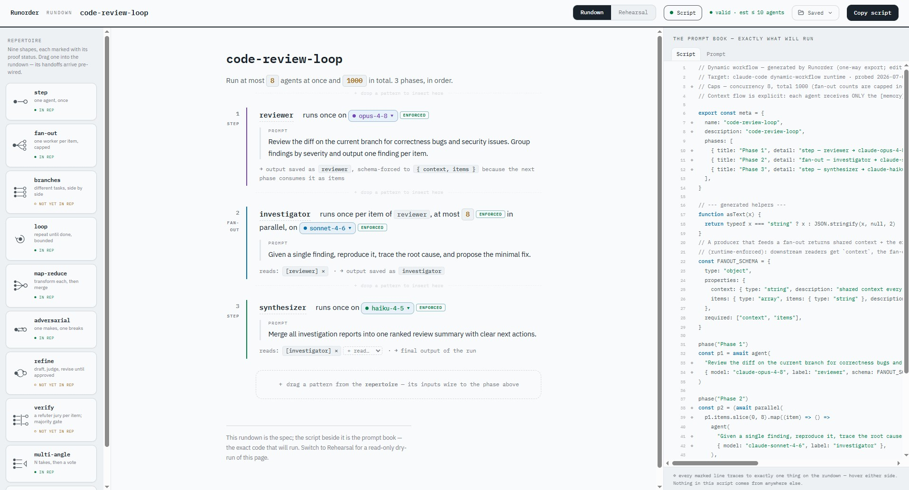

# Runorder

**See and pin your Claude Code workflow before it runs.**

Runorder is a web app for composing a multi-agent Claude Code **dynamic workflow** in a GUI —
then exporting it as a runtime-ready script you approve before anything spawns.



## Why

When you ask Claude Code to "run this as a workflow" (`ultracode`), it writes the orchestration
for you — and hides the decisions that matter: **which model each subagent uses, how many run in
parallel, and how the work is shaped.** You find out what it did after it has already burned the
tokens.

Runorder puts those decisions in front of you *before* the run. You lay the workflow out yourself,
watch a dry-run of exactly what will spawn, and export a script that pins every choice. Claude Code
still shows you its own approval screen — but now you already know what you're approving.

> Runorder targets Claude Code's native dynamic-workflow runtime (the `.js` orchestration triggered
> by `ultracode` / "run as a workflow") — **not** the standalone Claude Agent SDK.

## How you use it

1. **Compose.** Build the workflow as a rundown — a readable document of phases. Drag patterns
   (below) from the shelf into the seams between phases; each drop wires up fresh, named agents.
   Edit agents, models, and prompts in place.
2. **Wire nothing by hand.** Context flows between phases automatically through named memories, and
   producers that feed a parallel step are forced to hand off an exact list — so you only write
   *what each agent does*, not the plumbing.
3. **Rehearse.** A read-only dry-run shows exactly what will spawn: every agent, its model, and how
   many parallel copies (capped, so a fan-out can't run away). No tokens spent.
4. **Export & approve.** Export a runtime-valid script. Review it on Claude Code's own approval
   screen, then run it. You can also save workflows locally and export/import them as JSON.

## Patterns you can compose

Ten orchestration shapes, each a drag-in building block:

| Pattern | When to reach for it |
|---|---|
| **Step** | one agent, once |
| **Fan-out** | one worker per item, capped |
| **Branches** | different tasks, side by side |
| **Loop** | repeat until done, bounded |
| **Map-reduce** | transform each, then merge |
| **Adversarial** | one makes, one breaks |
| **Refine** | draft, judge, revise until approved |
| **Verify** | a refuter jury per item, with a majority gate |
| **Multi-angle** | N takes, then a vote |
| **A+ delegation** | a lead that spawns helpers |

Seven are proven by real end-to-end runs against the runtime; **refine**, **verify**, and
**branches** are built but not yet run-proven, and their shelf cards say so plainly.

## Honesty, by design

The whole point is trust, so Runorder never overclaims:

- **What's enforced vs. what's requested is labeled.** The "enforced" badge only appears for what
  the exported script actually pins — per-agent model, fan-out caps, output schemas. Anything the
  runtime merely *requests* is never dressed up as a guarantee.
- **Exports are one-way.** The workflow you compose is the source of truth; Runorder never tries to
  reconstruct it from a script you hand-edited afterward.
- **Proven means run, not reviewed.** A pattern is only marked proven once its emitted shape has
  executed end-to-end in the real runtime.

## Status

**MVP core, script-first.** The full path (compose → rehearse → export), local save/library, and
JSON import/export are built and tested — **211 passing tests**, typecheck and build clean. Live
probes confirmed that per-stage model routing is genuinely enforced by the runtime and that unknown
model ids fail loudly rather than silently falling back, which is why the script export is the
primary path.

Runorder is a pure client-side app; its home will be **runorder.dev** (deployment to Cloudflare
Pages is pending). For now, run it locally:

```bash
npm install
npm run dev        # open the Studio editor at the printed localhost URL
```

## For contributors

The app is a canonical spec model (Zod) with everything else — the emitted script, the prompt
fallback, the rehearsal, the UI — hanging off it as a projection.

```bash
npm test           # Vitest (single run)
npm run build      # typecheck + static dist/
npm run lint       # ESLint
```

Design and internals are documented separately:

| File | Contents |
|---|---|
| [`ProductDescription.md`](./ProductDescription.md) | Problem, audience, value prop, conceptual model, non-goals |
| [`Architecture.md`](./Architecture.md) | Canonical model + projections, the two emitters, pattern vocabulary, schema |
| [`MVP.md`](./MVP.md) | The V1 cut, validation rules, build order, the proof loop |
| [`OpenQuestions.md`](./OpenQuestions.md) | Empirical unknowns to resolve by running real workflows |
| [`CLAUDE.md`](./CLAUDE.md) | Working guidance, code map, guardrails, and **Next steps** |
| `mockups/` | UI-direction mockups; mockup 16 ("Studio") is the shipped direction |

Stack: TypeScript · React · Vite · Zod · Zustand + Immer · Tailwind v4 + shadcn/ui (Base UI) ·
Vitest + React Testing Library.

## License

[MIT](./LICENSE)
